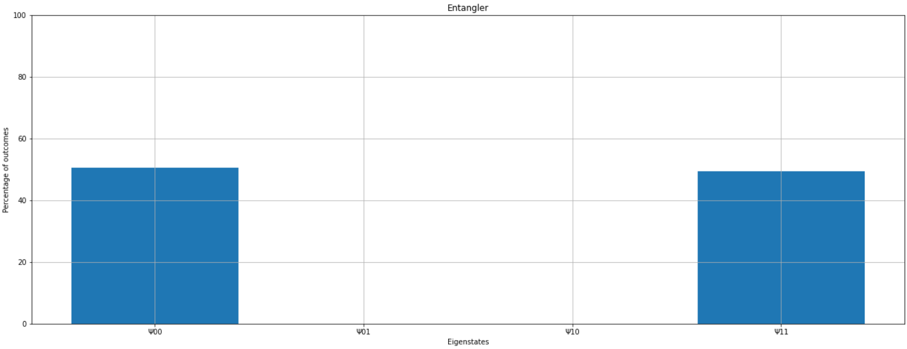
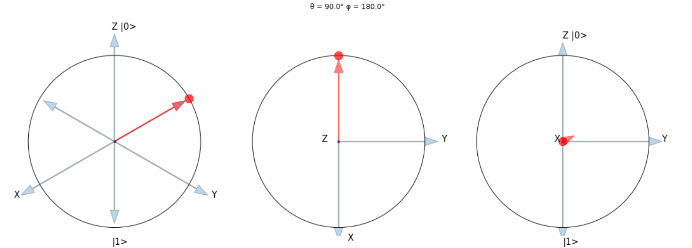

<p align="center">
  <a href="https://github.com/StealthyPanda/quantumcomputingsim" rel="noopener">
 </a>
</p>

<h3 align="center">Quantum Computing Simulator  </h3>

<div align="center">

  []() 
  [](https://img.shields.io/github/issues/stealthypanda/quantumcomputingsim.svg)
  [](https://img.shields.io/github/issues-pr/stealthypanda/quantumcomputingsim.svg)
  [](/LICENSE)

</div>

---

<p align="center"> A python library to simulate quantum programs and circuits.
    <br> 
</p>

## Table of Contents
- [Table of Contents](#table-of-contents)
- [Getting Started ](#getting-started-)
  - [Prerequisites](#prerequisites)
  - [Installing](#installing)
- [Usage ](#usage-)
- [Authors ](#authors-)

<!-- ## About <a name = "about"></a>
A python library to simulate quantum computing on classical computers. -->

## Getting Started <a name = "getting_started"></a>
These instructions will get you a copy of the project up and running on your local machine for development and testing purposes. See [deployment](#deployment) for notes on how to deploy the project on a live system.

### Prerequisites
This library is self contained, and optionally uses matplotlib for plotting graphs.

### Installing
This library can be installed from pypi using pip:


```
$ pip install quantumcomputingsim
```

To make sure everything installed properly, import the main and only module in python:

```
from quantum import *
```

<!-- ## 🔧 Running the tests <a name = "tests"></a>
Explain how to run the automated tests for this system.

### Break down into end to end tests
Explain what these tests test and why

```
Give an example
```

### And coding style tests
Explain what these tests test and why

```
Give an example
``` -->

## Usage <a name="usage"></a>
Sample workflow:

```
entangler = qprogram(
    nqbits = 2,
    name = "Entangler"
)
entangler.addgates(0, [HGATE, CNOT0])
entangler.compile()
```
Compiler result:
```
Compiling Entangler...

Entangler
q0(0) ⮕  -----[ h ]--⌈ c0 c0 ⌉-------
q1(0) ⮕  ------------⌊ c0 c0 ⌋-------


Compilation of Entangler complete!
```

and to run the program:

```
entangler.run(graph = True)
```


and view bloch spheres for qubits:
```
plotbloch(HGATE * [0, 1])
```


<!-- ## 🚀 Deployment <a name = "deployment"></a>
Add additional notes about how to deploy this on a live system.

## ⛏️ Built Using <a name = "built_using"></a>
- [MongoDB](https://www.mongodb.com/) - Database
- [Express](https://expressjs.com/) - Server Framework
- [VueJs](https://vuejs.org/) - Web Framework
- [NodeJs](https://nodejs.org/en/) - Server Environment -->

## Authors <a name = "authors"></a>
- [@stealthypanda](https://github.com/stealthypanda) - Idea & Initial work


<!-- 
See also the list of [contributors](https://github.com/kylelobo/The-Documentation-Compendium/contributors) who participated in this project.

## 🎉 Acknowledgements <a name = "acknowledgement"></a>
- Hat tip to anyone whose code was used
- Inspiration
- References -->